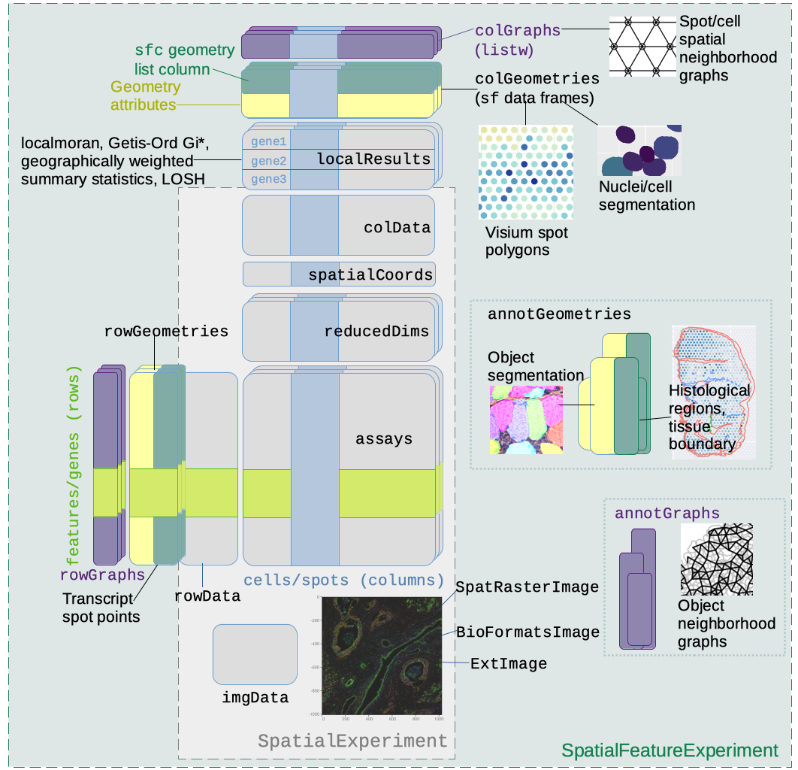

```{r, include = FALSE}
knitr::opts_chunk$set(
  collapse = TRUE,
  comment = "#>"
)
```

# `SpatialFeatureExperiment`
`SpatialFeatureExperiment` (SFE) is a new [S4](https://adv-r.hadley.nz/s4.html) class built on top of [`SpatialExperiment`](https://bioconductor.org/packages/release/bioc/html/SpatialExperiment.html) (SPE). SFE incorporates geometries and geometric operations with the [`sf`](https://cran.r-project.org/web/packages/sf/index.html) package. Examples of supported geometries are Visium spots represented with polygons corresponding to their size, cell or nuclei segmentation polygons, tissue boundary polygons, pathologist annotation of histological regions, and transcript spots of genes. Using `sf`, `SpatialFeatureExperiment` leverages the GEOS C++ library underlying `sf` for geometry operations, including algorithms for for determining whether geometries intersect, finding intersection geometries, buffering geometries with margins, etc. A schematic of the SFE object is shown below:

```{r, echo=FALSE, out.width = "100%",  fig.alt="SpatialFeatureExperiment expands on SpatialExperiment by adding column, row, and annotation geometries and spatial graphs. This is explained in detail in the following paragraphs."}

```

Below is a list of SFE features that extend the SPE object:

* `colGeometries` are `sf` data frames associated with the entities that correspond to columns of the gene count matrix, such as Visium spots or cells. The geometries in the `sf` data frames can be Visium spot centroids, Visium spot polygons, or for datasets with single cell resolution, cell or nuclei segmentations. Multiple `colGeometries` can be stored in the same SFE object, such as one for cell segmentation and another for nuclei segmentation. There can be non-spatial, attribute columns in a `colGeometry` rather than `colData`, because the `sf` class allows users to specify how attributes relate to geometries, such as "constant", "aggregate", and "identity". See the `agr` argument of the [`st_sf` documentation](https://r-spatial.github.io/sf/reference/sf.html).
* `colGraphs` are spatial neighborhood graphs of cells or spots. The graphs have class `listw` (`spdep` package), and the `colPairs` of `SingleCellExperiment` was not used so no conversion is necessary to use the numerous spatial dependency functions from `spdep`, such as those for Moran's I, Geary's C, Getis-Ord Gi*, LOSH, etc. Conversion is also not needed for other classical spatial statistics packages such as `spatialreg` and `adespatial`.
* `rowGeometries` are similar to `colGeometries`, but support entities that correspond to rows of the gene count matrix, such as genes. As we shall see below, a use case is to store transcript spots for each gene in smFISH or in situ sequencing based datasets.
* `rowGraphs` are similar to `colGraphs`. A potential use case may be spatial colocalization of transcripts of different genes.
* `annotGeometries` are `sf` data frames associated with the dataset but not directly with the gene count matrix, such as tissue boundaries, histological regions, cell or nuclei segmentation in Visium datasets, and etc. These geometries are stored in this object to facilitate plotting and using `sf` for operations such as to find the number of nuclei in each Visium spot and which histological regions each Visium spot intersects. Unlike `colGeometries` and `rowGeometries`, the number of rows in the `sf` data frames in `annotGeometries` is not constrained by the dimension of the gene count matrix and can be arbitrary.
* `annotGraphs` are similar to `colGraphs` and `rowGraphs`, but are for entities not directly associated with the gene count matrix, such as spatial neighborhood graphs for nuclei in Visium datasets, or other objects like myofibers. These graphs are relevant to `spdep` analyses of attributes of these geometries such as spatial autocorrelation in morphological metrics of myofibers and nuclei. With geometry operations with `sf`, these attributes and results of analyses of these attributes (e.g. spatial regions defined by the attributes) may be related back to gene expression.
* `localResults` are similar to [`reducedDims` in `SingleCellExperiment`](https://bioconductor.org/packages/release/bioc/vignettes/SingleCellExperiment/inst/doc/intro.html#3_Adding_low-dimensional_representations), but stores results from univariate and bivariate local spatial analysis results, such as from [`localmoran`](https://r-spatial.github.io/spdep/reference/localmoran.html), [Getis-Ord Gi\*](https://r-spatial.github.io/spdep/reference/localG.html), and [local spatial heteroscedasticity (LOSH)](https://r-spatial.github.io/spdep/reference/LOSH.html). Unlike in `reducedDims`, for each type of results (type is the type of analysis such as Getis-Ord Gi\*), each feature (e.g. gene) or pair of features for which the analysis is performed has its own results. The local spatial analyses can also be performed for attributes of `colGeometries` and `annotGeometries` in addition to gene expression and `colData`. Results of multivariate spatial analysis such as [MULTISPATI PCA](https://cran.r-project.org/web/packages/adespatial/vignettes/tutorial.html#multispati-analysis) can be stored in `reducedDims`.
* `imgData` store images associated with the dataset. This field is inherited from SPE, but SFE has extended the image functionalities so images are not loaded into memory unless necessary.

```{r setup, message=FALSE}
library(Matrix)
library(sf)
library(fs) # I put it after sf intentionally
library(terra)
library(ggplot2)
library(SingleCellExperiment)
library(Seurat)
library(scater)
library(scran)
library(SpatialExperiment)
library(SpatialFeatureExperiment)
library(SFEData)
library(Voyager)
library(EBImage)
library(scales)
library(patchwork)
library(dplyr)
library(tidyr)
library(tibble)
library(stringr)
library(arrow)
library(sparseMatrixStats)
library(metrica)
theme_set(theme_bw())
```

# SFE object construction
## From scratch
An SFE object can be constructed from scratch with the assay matrices and metadata. In this toy example, `dgCMatrix` is used, but since SFE inherits from SingleCellExperiment (SCE), other types of arrays supported by SCE such as delayed arrays should also work.
```{r}
# Visium barcode location from Space Ranger
data("visium_row_col")
coords1 <- visium_row_col[visium_row_col$col < 6 & visium_row_col$row < 6,]
coords1$row <- coords1$row * sqrt(3)

# Random toy sparse matrix
set.seed(29)
col_inds <- sample(1:13, 13)
row_inds <- sample(1:5, 13, replace = TRUE)
values <- sample(1:5, 13, replace = TRUE)
mat <- sparseMatrix(i = row_inds, j = col_inds, x = values)
colnames(mat) <- coords1$barcode
rownames(mat) <- sample(LETTERS, 5)
```

That should be sufficient to create an SPE object, and an SFE object, even though no `sf` data frame was constructed for the geometries. The constructor behaves similarly to the SPE constructor. The centroid coordinates of the Visium spots in the toy example can be converted into spot polygons with the `spotDiameter` argument. Spot diameter in pixels in full resolution image can be found in the `scalefactors_json.json` file in Space Ranger output.

```{r}
sfe3 <- SpatialFeatureExperiment(list(counts = mat), colData = coords1,
                                spatialCoordsNames = c("col", "row"),
                                spotDiameter = 0.7)
```

When `colData` contains columns for the centroid coordinates, the `spatialCoordsNames` argument specifies which columns in `colData` are for the coordinates, in the same order as x, y, and z (if applicable). If the coordinates are not in `colData`, they can be specified separately in the `spatialCoords` argument:

```{r}
sfe3 <- SpatialFeatureExperiment(list(counts = mat), 
                                 spatialCoords = as.matrix(coords1[, c("col", "row")]),
                                 spotDiameter = 0.7)
```

More geometries and spatial graphs can be added after calling the constructor.

Geometries can also be supplied in the constructor. 
```{r}
# Convert regular data frame with coordinates to sf data frame
cg <- df2sf(coords1[,c("col", "row")], c("col", "row"), spotDiameter = 0.7)
rownames(cg) <- colnames(mat)
sfe3 <- SpatialFeatureExperiment(list(counts = mat), colGeometries = list(foo = cg))
```

## Space Ranger output
Space Ranger output can be read in a similar manner as in `SpatialExperiment`; the returned SFE object has the `spotPoly` column geometry for the spot polygons. If the filtered matrix is read in, then a column graph called `visium` will also be present, for the spatial neighborhood graph of the Visium spots on tissue. The graph is not computed if all spots are read in regardless of whether they are on tissue.

```{r}
dir <- system.file("extdata", package = "SpatialFeatureExperiment")
sample_ids <- c("sample01", "sample02")
samples <- file.path(dir, sample_ids)
```

Inside the `outs` directory:
```{r}
list.files(file.path(samples[1], "outs"))
```

There should also be `raw_feature_bc_matrix` though this toy example only has the filtered matrix.

Inside the matrix directory:
```{r}
list.files(file.path(samples[1], "outs", "filtered_feature_bc_matrix"))
```

Inside the `spatial` directory:
```{r}
list.files(file.path(samples[1], "outs", "spatial"))
```

Not all Visium datasets have all the files here. The `barcode_fluorescence_intensity.csv` file is only present for datasets with fluorescent imaging rather than bright field H&E. 

```{r}
(sfe3 <- read10xVisiumSFE(samples, sample_id = sample_ids, type = "sparse", 
                          data = "filtered", images = "hires"))
```

The `barcode_fluorescence_intensity.csv` file is read into `colData`. The `spatial_enrichment.csv` file contains Moran's I and its p-values for each gene; it is read into `rowData`. 

Instead of pixels in the full resolution image, the Visium data can be read so the units are microns. Full resolution pixels is related to microns by the spacing between spots, which is known to be 100 microns. The unit can be set in the `unit` argument; for now only "micron" and "full_res_image_pixel" are supported for Visium:

```{r}
(sfe3 <- read10xVisiumSFE(samples, sample_id = sample_ids, type = "sparse", 
                          data = "filtered", images = "hires", unit = "micron"))
```

The unit of the SFE object can be checked:
```{r}
unit(sfe3)
```

At present, this is merely a string and SFE doesn't perform unit conversion.

Unlike in `SpatialExperiment`, SFE reads the Visium images as `terra::SpatRaster` objects, so the images are not loaded into memory unless necessary. Also, with `terra`, if a larger image is associated with the SFE object, it will not be fully loaded into memory when plotted; rather, it's downsampled.

```{r}
class(imgRaster(getImg(sfe3)))
```

This example here is for old fashioned Visium; we are working on a read function and vignette for higher resolution [VisiumHD](https://www.10xgenomics.com/products/visium-hd-spatial-gene-expression) data.

## Vizgen MERFISH output
The commercialized MERFISH from Vizgen has a standard output format, that can be read into SFE with `readVizgen()`. Because the cell segmentation from each field of view (FOV) has a separate HDF5 file and a MERFISH dataset can have hundreds of FOVs, we strongly recommend reading the MERFISH output on a server with a large number of CPU cores. Alternatively, some but not all MERFISH datasets store cell segmentation in a `parquet` file, which can be more easily read into R. This requires the installation of [`arrow`](https://arrow.apache.org/).

The `SFEData` package (version 1.6.0 and later) provides smaller subsets of data in the standard output format for MERFISH, Xenium, and CosMX for testing and example purposes via the `*Output` functions.

Here we read a toy dataset which is the first FOV from a real dataset; _note that the first time you run this code, the code chink in the notebook appears to stall and you need to go to the R console to type Yes to download the dataset_:

```{r}
fp <- tempdir()
dir_use <- VizgenOutput(file_path = file.path(fp, "vizgen"))
dir_tree(dir_use)
```

The optional `add_molecules` argument can be set to `TRUE` to read in the transcript spots; behind the scene, this calls the `formatTxSpots()` function, which can also be called separately.
```{r}
(sfe_mer <- readVizgen(dir_use, z = 3L, add_molecules = TRUE))
```

The unit is always in microns. To make it easier and faster to read the data next time, the transcript spots are written to a file `detected_transcripts.parquet` in the same directory where the data resides:
```{r}
dir_tree(dir_use)
```

The GeoParquet file is much smaller than the original CSV file:
```{r, results='hold'}
file_size(file.path(dir_use, "detected_transcripts.csv"))
file_size(file.path(dir_use, "detected_transcripts.parquet"))
```

## 10X Xenium output
SFE supports reading the output from Xenium Onboarding Analysis (XOA) v1 and v2 with the function `readXenium()`. Especially for XOA v2, `arrow` is strongly recommended. The cell and nuclei polygon vertices and transcript spot coordinates are in `parquet` files  Similar to `readVizgen()`, `readXenium()` makes `sf` data frames from the vertices and transcript spots and saves them as GeoParquet files.

```{r}
dir_use <- XeniumOutput("v2", file_path = file.path(fp, "xenium"))
dir_tree(dir_use)
```

```{r}
# RBioFormats issue: https://github.com/aoles/RBioFormats/issues/42
try(sfe_xen <- readXenium(dir_use, add_molecules = TRUE))
(sfe_xen <- readXenium(dir_use, add_molecules = TRUE))
```

The processed cell segmentation is written to `cell_boundaries_sf.parquet` as GeoParquet for faster reading next time, nucleus segmentation to `nucleus_boundaries_sf.parquet`, and transcript spots to `tx_spots.parquet`.
```{r}
dir_tree(dir_use)
```

The upcoming Xenium Prime (XOA v3) with 5k gene panel poses a challenge to the `readXenium` function when making the GeoParquet file. Writing the GeoParquet file may fail due to an error that might be related to [this](https://lists.apache.org/thread/9ffnb5wh9fyo614oyhtq2mo32ykn23sw) and it's not specific to the R interface to `arrow`. For the 5k panel and datasets with larger numbers of cells, I may write multiple GeoParquet files and then concatenate them with with DuckDB for the next release. 

In addition, for large GeoParquet transcript spot files, with the GDAL Parquet driver (requires GDAL version 3.5.0 or higher), we can selectively load transcript spots of genes of interest, for e.g. visualization purposes, with the `readSelectTx()` function. This is the beginning of an on disk shadow of the SFE object. [Genentech's ArtifactDB project](https://github.com/ArtifactDB) aims to implement language-agnostic on-disk serialization of objects such as matrices, `SingleCellExperiment`, and `SpatialExperiment` to facilitate interoperability between programming languages. In R, such serialization is performed with the `alabaster` series of packages on Bioconductor. These GeoParquet files can be the beginning of `alabaster.sfe` whose non-geometric aspects are handled by the existing [`alabaster.sce`](https://github.com/ArtifactDB/alabaster.sce) and [`alabaster.spatial`](https://github.com/ArtifactDB/alabaster.spatial).

## Nanostring CosMX output
This is similar to `readVizgen()` and `readXenium()`, except that the output doesn't come with images.

```{r}
dir_use <- CosMXOutput(file_path = file.path(fp, "cosmx"))
dir_tree(dir_use)
```

```{r}
(sfe_cosmx <- readCosMX(dir_use, add_molecules = TRUE))
```

Processed cell segmentation and transcript spots are also saved in GeoParquet files.

```{r}
dir_tree(dir_use)
```

## Other technologies
A read function for Visium HD is in progress. Contribution for Akoya, Molecular Cartography, and Curio Seeker are welcome. See the [issues](https://github.com/pachterlab/SpatialFeatureExperiment/issues).

## Coercion from `SpatialExperiment`
SPE objects can be coerced into SFE objects. If column geometries or spot diameter are not specified, then a column geometry called "centroids" will be created.
```{r}
spe <- read10xVisium(samples, sample_ids, type = "sparse", data = "filtered", 
  images = "hires", load = FALSE)
```

For the coercion, column names must not be duplicate.
```{r}
colnames(spe) <- make.unique(colnames(spe), sep = "-")
rownames(spatialCoords(spe)) <- colnames(spe)
```

```{r}
(sfe3 <- toSpatialFeatureExperiment(spe))
```

If images are present in the SPE object, they will be converted into `SpatRaster` when the SPE object is converted into SFE. Plotting functions in the `Voyager` package require image classes implemented in SFE (covered later in this workshop) to plot the image behind the geometries. 

## Coercion from `Seurat`
Seurat objects can be coerced into SFE objects though coercion from SFE to Seurat is not yet implemented.
```{r}
dir_extdata <- system.file("extdata", package = "SpatialFeatureExperiment")
obj_vis <- readRDS(file.path(dir_extdata, "seu_vis_toy.rds"))
```

```{r}
sfe_conv_vis <-
  toSpatialFeatureExperiment(x = obj_vis, 
                             image_scalefactors = "lowres",
                             unit = "micron",
                             BPPARAM = BPPARAM)
sfe_conv_vis
```

# Getting, setting, and plotting fields of SFE objects
Here we demonstrate operations on SFE objects on one of the datasets read in just now, `sfe_xen`, from 10X Xenium XOA v2 data from the human pancreas.

## `SingleCellExperiment` getters and setters
Each SFE object is an SCE object as SFE builds on top of SCE, or inherits from SCE, so all the SCE methods apply. Here "inherits" is just like each bioinformatician is a human, where "bioinformatician" is a bit like SFE and "human" is like SCE. Here we go over SCE getters and setters.

At the center of SCE is the gene count matrix. You can get or set the gene count matrix with `counts` function:
```{r}
m <- counts(sfe_xen)
head(m)
```

Here the gene count matrix was read from an HDF5 file as `DelayedMatrix` and not fully loaded into memory; this helps with analyzing [data that doesn't fit into memory](https://bioconductor.org/packages/release//data/experiment/vignettes/TENxBrainData/inst/doc/TENxBrainData.html). See [the `DelayedArray` package](https://bioconductor.org/packages/release/bioc/html/DelayedArray.html) for more info and operations on `DelayedMatrix`.

```{r}
# Setter
counts(sfe_xen) <- m
```

After log normalizing data, similarly the `logcounts()` function can be used to get or set the log normalized gene count matrix.

The gene count matrix has metadata about the cells and genes. Use the `colData` function to get cell metadata and `rowData` to get gene metadata
```{r}
colData(sfe_xen)
```

```{r}
rowData(sfe_xen)
```

Just like in Seurat, the SCE object can be subsetted like a matrix, for example, to remove low quality cells with too few transcript counts and genes that are not detected. `colData` columns in SCE can be accessed with the `$` operator as if getting a column from a data frame. When it comes to the data frame analogy, also see the [tidyOmics packages](https://www.nature.com/articles/s41592-024-02299-2) that brings the Tidyverse to -omics data and gives a unified user interface uniting Seurat and SCE analyses.

```{r}
sfe_xen <- sfe_xen[, sfe_xen$total_counts > 5]
sfe_xen <- sfe_xen[rowSums(counts(sfe_xen)) > 0,]
dim(sfe_xen)
```

PCA is part of the standard scRNA-seq data analysis workflow. Here we'll first normalize the data and then perform PCA and get the PCA results.
```{r}
sfe_xen <- logNormCounts(sfe_xen, size.factors = sfe_xen$cell_area)
# Log counts getter
logcounts(sfe_xen) |> head()
```

```{r}
sfe_xen <- runPCA(sfe_xen, ncomponents = 20,
                  exprs_values = "logcounts", scale = TRUE)
```

Later we will see that Voyager spatial analysis functions are modeled after `runPCA` un user interface. The `reducedDim` function can be used to get and set dimension reduction results. User interfaces to get or set the geometries and spatial graphs emulate those of `reducedDims` and `row/colPairs` in `SingleCellExperiment`. Column and row geometries also emulate `reducedDims` in internal implementation, while annotation geometries and spatial graphs differ.

```{r}
pca_res <- reducedDim(sfe_xen, "PCA")
head(pca_res)
```

Here the second argument is used to specify which dimension reduction result to get. If it's not specified, then by default the first one is retrieved, so the code below would be equivalent to the previous chunk:
```{r}
reducedDim(sfe_xen) |> head()
```

```{r}
# Set PCA embeddings say if you ran PCA elsewhere
reducedDim(sfe_xen, "PCA") <- pca_res
```

Which dimension reductions are present?
```{r}
reducedDimNames(sfe_xen)
```

## Column geometries
Column geometries or `colGeometries` are the geometries that correspond to columns of the gene count matrix, such as Visium spots and cells in datasets from a single cell resolution technology. Each SFE object can have multiple column geometries. For example, in a dataset with single cell resolution, whole cell segmentation and nuclei segmentation are two different `colGeometries`. However, for Visium, the spot polygons are the only `colGeometry` obviously relevant, though users can add other geometries such as results of geometric operations on the spot polygons. The different geometries can be get or set with their names; "spotPoly" is the standard name for Visium spot polygons, "cellSeg" for cell segmentation, and "nucSeg" for nucleus segmentation.
```{r}
# Get Visium spot polygons
(cells <- colGeometry(sfe_xen, "cellSeg"))
```

Here we get a `sf` data frame, which is just like a regular data frame but with a special `geometry` column. Now plot these cells

```{r}
ggplot(cells) + geom_sf()
```

The `Voyager` package can plot the geometries without other data with the `plotGeometry()` function. Note that the arguments have changed since version 1.7.0 (`devel` version)
```{r}
plotGeometry(sfe_xen, colGeometryName = "cellSeg", show_axes = TRUE) +
    plotGeometry(sfe_xen, colGeometryName = "cellSeg", show_axes = TRUE, dark = TRUE)
```

A bounding box can be used to zoom into a smaller region in `plotGeometry` and any other geometry plotting function in `Voyager` such as `plotSpatialFeature`.

```{r}
bbox <- c(xmin = 0, xmax = 200, ymin = -600, ymax = -400)
```

```{r}
plotGeometry(sfe_xen, colGeometryName = "cellSeg", bbox = bbox)
```

Multiple geometries, such as cells and nuclei, can be plotted at once (only supported in version 1.7.0 or later)
```{r}
plotGeometry(sfe_xen, colGeometryName = c("cellSeg", "nucSeg"), bbox = bbox)
```

```{r}
# Set colGeometry
colGeometry(sfe_xen, "cellSeg") <- cells
```

To see which `colGeometries` are present in the SFE object:
```{r}
colGeometryNames(sfe_xen)
```

There are shorthands for some specific column or row geometries. For example, `spotPoly(sfe)` is equivalent to `colGeometry(sfe, "spotPoly")`, `cellSeg(sfe)` is equivalent to `colGeometry(sfe, "cellSeg")`, and `nucSeg(sfe)` to `colGeometry(sfe, "nucSeg")`. 

```{r}
# Getter
(cells <- cellSeg(sfe_xen))
```

```{r}
# Setter
cellSeg(sfe_xen) <- cells
```

Exercise: Get and plot nucleus segmentations from `sfe_xen`

## Annotation
Annotation geometries can be get or set with `annotGeometry()`. In column or row geometries, the number of rows of the `sf` data frame (i.e. the number of geometries in the data frame) is constrained by the number of rows or columns of the gene count matrix respectively, because just like `rowData` and `colData`, each row of a `rowGeometry` or `colGeometry` `sf` data frame must correspond to a row or column of the gene count matrix respectively. In contrast, an `annotGeometry` `sf` data frame can have any dimension, not constrained by the dimension of the gene count matrix. 

This Xenium dataset doesn't come with `annotGeometries`, but I used QuPath to annotate some just for the purpose of demonstration and testing. While it looks like two sides of a river in this section, it's actually not two separate pieces of tissue because the original tissue is 3 dimensional.

```{r}
pieces <- readRDS(system.file("extdata/pieces.rds", package = "SpatialFeatureExperiment"))
pieces <- st_sf(geometry = pieces, sample_id = "sample01")
annotGeometry(sfe_xen, "pieces") <- pieces
```

```{r}
# Getter, by name or index
(tb <- annotGeometry(sfe_xen, "pieces"))
```

```{r}
ggplot(tb) + geom_sf()
```

Or use `plotGeometry`

```{r}
plotGeometry(sfe_xen, annotGeometryName = "pieces", show_axes = TRUE)
```

```{r}
plotGeometry(sfe_xen, colGeometryName = "cellSeg", annotGeometryName = "pieces",
             show_axes = TRUE)
```

See which `annotGeometries` are present in the SFE object:
```{r}
annotGeometryNames(sfe_xen)
```

There are shorthands for specific annotation geometries. For example, `tissueBoundary(sfe)` is equivalent to `annotGeometry(sfe, "tissueBoundary")`. `cellSeg()` (cell segmentation) and `nucSeg()` (nuclei segmentation) would first query `colGeometries` (for single cell, single molecule technologies, equivalent to `colGeometry(sfe, "cellSeg")` or `colGeometry(sfe, "nucSeg")`), and if not found, they will query `annotGeometries` (for array capture and microdissection technologies, equivalent to `annotGeometry(sfe, "cellSeg")` or `annotGeometry(sfe, "nucSeg")`). 

## Spatial graphs
The spatial neighborhood graphs for Visium spots are stored in the `colGraphs` field, which has similar user interface as `colGeometries`. SFE also wraps all methods to find the spatial neighborhood graph implemented in the `spdep` package, and triangulation is used here as demonstration.
```{r}
(g <- findSpatialNeighbors(sfe_xen, MARGIN = 2, method = "tri2nb"))
```

```{r}
# Set graph by name
colGraph(sfe_xen, "triangulation") <- g
```

```{r}
# Get graph by name
(g <- colGraph(sfe_xen, "triangulation"))
```

Plot the graph in space
```{r}
plotColGraph(sfe_xen, colGraphName = "triangulation")
```

Alternatively use k nearest neighbor graph
```{r}
colGraph(sfe_xen, "knn") <- findSpatialNeighbors(sfe_xen, method = "knearneigh",
                                                 k = 5)
```

```{r}
plotColGraph(sfe_xen, colGraphName = "knn")
```

Which graphs are present in this SFE object?
```{r}
colGraphNames(sfe_xen)
```

It would be interesting to see the implications of the choice of spatial neighborhood graph and its edge weights to further spatial analyses.

## Row geometries
The `rowGeometry` getter and setter have pretty much the same user interface as the getters and setters covered above:
```{r}
(rg <- rowGeometry(sfe_xen, "txSpots"))
```

Note the `MULTIPOINT Z` here; this is 3D. Geometric operations in `sf` such as finding intersections do work on 3D geometries but only for the x and y dimensions, not for z. 

```{r}
# Setter
rowGeometry(sfe_xen, "txSpots") <- rg
```

In the case of transcript spots, there's a special convenience function `txSpots`; I haven't thought of any other use for `rowGeometries` but this is kept general, allowing any type of geometry, in case other use cases come up.
```{r}
txSpots(sfe_xen)
```

The `plotGeometry()` function can plot transcript spots, for all genes or for a few selected genes, distinguished by point shape.
```{r}
# bbox is used due to overplotting if plotting the entire example data
plotGeometry(sfe_xen, rowGeometryName = "txSpots", bbox = bbox, gene = "all")
```

That's still a lot of spots. Plot a few genes here:
```{r}
set.seed(29)
genes_use <- sample(rownames(sfe_xen)[rowData(sfe_xen)$Type == "Gene Expression"], 6)
# Genes that don't have spots in this bbox are not plotted
plotGeometry(sfe_xen, rowGeometryName = "txSpots", bbox = bbox, gene = genes_use)
```

Or plot the transcript spots with other geometries
```{r}
plotGeometry(sfe_xen, colGeometryName = c("cellSeg", "nucSeg"),
             rowGeometryName = "txSpots", bbox = bbox, gene = genes_use)
```

Transcript spots can also be plotted along with cell level data
```{r}
plotSpatialFeature(sfe_xen, "total_counts", colGeometryName = "cellSeg", 
                   rowGeometryName = "txSpots", rowGeometryFeatures = genes_use,
                   bbox = bbox, tx_fixed = list(size = 1))
```

Or plot in dark theme
```{r}
plotSpatialFeature(sfe_xen, "total_counts", colGeometryName = "cellSeg", 
                   rowGeometryName = "txSpots", rowGeometryFeatures = genes_use,
                   bbox = bbox, show_axes = TRUE, dark = TRUE,
                   tx_fixed = list(size = 1, color = "lightgray"))
```

When cell level data and transcript spots of the same genes are plotted, each gene will be plotted in a separate panel
```{r}
plotSpatialFeature(sfe_xen, genes_use, colGeometryName = "cellSeg", 
                   rowGeometryName = "txSpots", rowGeometryFeatures = genes_use,
                   bbox = bbox)
```

Note that some transcript spots are not in cells; spots in `rowGeometires` don't have to be assigned to cells.

Transcript spot density can be plotted in a 2D histogram, here using 20 micron hexagonal grid
```{r}
plotTxBin2D(sfe_xen, binwidth = 20, hex = TRUE)
```


# Images
In SPE, the images are only used for visualization, but SFE extended the SPE image functionality so large images don't have to be loaded into memory unless necessary. SFE is extensible; more image classes can be implemented by inheriting from the virtual class `AlignedSpatialImage`; "aligned" because a spatial extent must be specified to align the image to the geometries, just like the satellite image aligned to vector geometries of roads and city boundaries. At present, the SFE package implements 3 types of images: `SpatRasterImage`, `BioFormatsImage`, and `ExtImage`.

## `SpatRasterImage`
`SpatRasterImage` is the default, a thin wrapper around the [`SpatRaster`](https://rspatial.github.io/terra/reference/SpatRaster-class.html) class in the `terra` object to make it conform to SPE's requirements. Large images are not loaded into memory unless necessary and it's possible to only load a down sampled lower resolution version of the image into memory. Spatial extent is part of `SpatRaster`. The extent is important to delineate where the image is in the coordinate system within the tissue section. This is a more sophisticated way to make sure the image is aligned with the geometries than the scale factor in SPE which only works for Visium and would not allow the SPE object to be cropped.

In the MERFISH dataset above, the image is represented as `SpatRasterImage`. Get images with the `getImg()` function, and use the `image_id` function to indicate which image to get, and if it's left blank, the first image will be retrieved:

```{r}
(img <- getImg(sfe_mer, image_id = "PolyT_z3"))
```

The `imgData()` getter gets all images in the SFE object and displays a summary including image dimension and class
```{r}
imgData(sfe_mer)
```

To see what are the `image_id`s present in the SFE object
```{r}
imageIDs(sfe_mer)
```

Use the `ext` function to get the extent of the image
```{r}
ext(img)
```

The images from SFE objects can be plotted with the `plotImage()` function in `Voyager`
```{r}
plotImage(sfe_mer, image_id = "PolyT_z3")
```

Or for `SpatRasterImage`, with the `plot` function in `terra` (only works in SFE 1.7.0 or later; earlier versions need to call `plot(imgRaster(img))`)
```{r}
plot(img)
```

The image can be plotted behind cell level data in all `Voyager` functions that plot geometries
```{r}
plotSpatialFeature(sfe_mer, features = "transcript_count", colGeometryName = "cellSeg",
                   aes_use = "color", fill = NA, # Only color by cell outline
                   image_id = "PolyT_z3", dark = TRUE)
```

The advantage of `SpatRasterImage` is that one can use vector geometries such as in `sf` data frames to extract data from the raster image. With a binary mask, the `terra` package can convert the mask into polygons and vice versa. 

Here we extract PolyT intensity values within each cell and see how they relate to total transcript counts
```{r}
polyt_values <- terra::extract(img, cellSeg(sfe_mer))
polyt_sum <- polyt_values |> 
    group_by(ID) |> 
    summarize(polyt = sum(mosaic_PolyT_z3))
polyt_sum$total_counts <- sfe_mer$transcript_count
ggplot(polyt_sum, aes(polyt, total_counts)) +
    geom_point() +
    geom_density2d(color = "cornflowerblue")
```

This way we can relate data from the images to other cell level data, which includes gene expression data.

But there are some disadvantages, such as that `terra` is built for geography so it's difficult to perform affine transforms of the image (including rotation); in geography the transformation is performed by reprojecting the map and there are standards for the projections such as the Mercator and Robinson projections of the world map. So when the `SpatRasterImage` is rotated, it's converted into `ExtImage`, which can be converted back to `SpatRasterImage`. `BioFormatsImage` can also be converted into `SpatRasterImage` though that goes through `ExtImage`. 

`ExtImage` is a thin wrapper around the [`Image`](https://bioconductor.org/packages/release/bioc/vignettes/EBImage/inst/doc/EBImage-introduction.html#3_Image_data_representation) class in the `EBImage` package to conform to SPE's requirements and to add a spatial extent. With `ExtImage`, one can do thresholding and morphological operations. However, it's not merely a wrapper; it contains another metadata field for the extent. When `BioFormatsImage` is loaded into memory, it becomes `EBImage`.

Here we convert this image into `ExtImage`, and plot it with the `EBImage` package; the `normalize()` function is called because `display()` expects the values to be between 0 and 1.
```{r}
ebi <- toExtImage(img)
display(normalize(ebi))
```

With `EBImage`, we can apply tools from the image processing tradition, such as [morphological operations](https://bioconductor.org/packages/release/bioc/vignettes/EBImage/inst/doc/EBImage-introduction.html#73_Morphological_operations). Here we use Otsu threasholding to automatically find a threshold to segment the tissue followed by an opening operation to remove small bits and closing to fill holes

```{r}
th <- otsu(ebi, range = range(ebi), levels = max(ebi))
mask <- ebi > th
display(mask)
```

```{r}
mask <- opening(mask) |> closing()
display(mask)
```

This mask can be converted into a polygon through `SpatRasterImage` and `terra::as.polygons`. Here the mask still has the spatial extent, which makes sure that it's still aligned to the geometries regardless of pixel size.
```{r}
ext(mask)
```

```{r}
mask_spi <- toSpatRasterImage(mask)
(tb <- as.polygons(mask_spi) |> st_as_sf())
```

Here the region with value 0 (not in tissue) and value 1 (in tissue) have been converted to polygons.
```{r}
ggplot(tb, aes(fill = lyr.1)) + geom_sf()
```

The polygons can be added back to the SFE object; here say I'm only interested in value 1
```{r}
tb <- tb |> 
    filter(lyr.1 == 1L) |> 
    select(geometry) |> 
    mutate(sample_id = "sample01")
tissueBoundary(sfe_mer) <- tb
```

```{r}
plotSpatialFeature(sfe_mer, features = "transcript_count", colGeometryName = "cellSeg",
                   annotGeometryName = "tissueBoundary",
                   aes_use = "color", fill = NA, # Only color by cell outline
                   # Don't fill the tissue boundary either
                   annot_fixed = list(fill = NA, color = "magenta"),
                   image_id = "PolyT_z3", dark = TRUE)
```

## `BioFormatsImage`
`BioFormatsImage` is used for [`OME-TIFF`](https://docs.openmicroscopy.org/ome-model/5.6.3/ome-tiff/) images whose compression can't be read by `terra`. The image is not loaded into memory. It's just some metadata, which includes the file path, extent, origin (minimum value of coordinates), and affine transformation information to apply the transformation on the fly when a part of the image is loaded into memory. So far functions related to `BioFormatsImage` cater to Xenium data. This is somewhat similar to [`stars` proxy objects](https://r-spatial.github.io/stars/articles/stars2.html), which also only has metadata in memory, in another commonly used raster package `stars`.

Here images from the Xenium dataset is read as `BioFormatsImage`
```{r}
imgData(sfe_xen)
```

```{r}
getImg(sfe_xen)
```

While the images in the MERFISH dataset above only have 1 channel, this image has 4 channels, which are DAPI, ATP1A1/CD45/E-Cadherin, 18S, and AlphaSMA/Vimentin, in this order. The images are pyramids with multiple resolutions; some applications would not require the highest resolution. The file for each channel is around 370 MB. Only the metadata is read in R and only the relevant portion of the image at the highest resolution necessary is loaded into memory when needed, say when plotting. 

One can select up to 3 channels (in the order of RGB) for plotting; `channel` must be specified when there are more than 3 channels in the image, and this may not be colorblind friendly

```{r}
plotImage(sfe_xen, image_id = "morphology_focus", channel = 3:1)
```

Or plot the channels separately in gray scale
```{r}
plotImage(sfe_xen, image_id = "morphology_focus", channel = 1) +
    plotImage(sfe_xen, image_id = "morphology_focus", channel = 2)
```

The color palette can be changed
```{r}
plotImage(sfe_xen, image_id = "morphology_focus", channel = 1, 
          palette = viridis_pal()(255))
```

Multiple channels can be plotted behind geometries and cell level data (the image in the example data is not the highest resolution from the original data from the 10X website in order to reduce download time)
```{r}
plotSpatialFeature(sfe_xen, genes_use[6], colGeometryName = "cellSeg", 
                   rowGeometryName = "txSpots", image_id = "morphology_focus",
                   fill = NA, aes_use = "color", 
                   tx_fixed = list(color = "lightgray"),
                   channel = 3:1, bbox = bbox, dark = TRUE)
```

Converting the image into `ExtImage` will load it into memory, and one can select the resolution in the pyramid to load
```{r}
(ebi2 <- toExtImage(getImg(sfe_xen), resolution = 2L))
```

```{r}
# Use the arrows on the top left of the widget to see different channels
display(normalize(ebi2))
```

# Spatial operations
## Bounding box
The bounding box of a geometry is the smallest rectangle that contains this geometry, so you get minimum and maximum x coordinates and y coordinates. We can find the bounding box of individual `sf` data frames with `st_bbox` from the `sf` package

```{r}
st_bbox(rg)
```

However, in an SFE object, there are multiple geometries, such as cell centroids, cell segmentation, nucleus segmentation, tissue boundary, transcript spots, and so on, and there are images. The `bbox` function for SFE aggregates the bounding boxes of all the geometries (and optionally images) to get an overall bounding box of the SFE object:
```{r}
bbox(sfe_xen)
```

```{r}
# In this case the image is not larger than the geometries
bbox(sfe_xen, include_image = TRUE)
```

## Cropping
You can think of the SFE object as a stack of maps that are aligned, like the [National Map](https://apps.nationalmap.gov/viewer/) layers of satellite images, land use, administrative boundaries, watersheds, rock formations, faults, and etc. Cropping will crop all of the maps. One can crop with either a bounding box or a polygon of any shape. The `colGeometryName` argument specifies the `colGeometry` to decide which cell to keep after cropping. Using the centroid would be different from using the cell polygon since a polygon can slightly overlap with the bounding box while the centroid is outside.

```{r}
sfe_cropped <- crop(sfe_xen, bbox, colGeometryName = "cellSeg")
bbox(sfe_cropped)
dim(sfe_cropped)
```

Now we only have 207 cells in this bounding box as opposed to around 6000 in the original. Here plot the cropped SFE object
```{r}
plotSpatialFeature(sfe_cropped, genes_use[6], colGeometryName = "cellSeg", 
                   rowGeometryName = "txSpots", image_id = "morphology_focus",
                   fill = NA, aes_use = "color", 
                   tx_fixed = list(color = "lightgray"),
                   channel = 3:1, dark = TRUE)
```

Don't like those tiny slivers of cells at the boundary of the bounding box? We can also keep any cell that intersects with the bounding box and with larger datasets, this is much faster than finding the actual intersection geometries. The `keep_whole` argument makes sure that the cells are kept whole; "col" because it can also be "annot" to keep `annotGeometry` items (e.g. cell segmentation in Visium datasets) whole.
```{r}
sfe_cropped2 <- crop(sfe_xen, bbox, colGeometryName = "cellSeg",
                     keep_whole = "col")
```

```{r}
plotSpatialFeature(sfe_cropped2, genes_use[6], colGeometryName = "cellSeg", 
                   rowGeometryName = "txSpots", image_id = "morphology_focus",
                   fill = NA, aes_use = "color", 
                   tx_fixed = list(color = "lightgray"),
                   channel = 3:1, dark = TRUE) +
    geom_sf(data = st_as_sfc(st_bbox(bbox)), fill = NA, color = "red", 
            linewidth = 0.5)
```

Here the original bounding box is shown in red and the cells that partially overlap are not cropped.

We can also only keep cells covered by (i.e. entirely within) the bounding box

```{r}
sfe_cropped3 <- crop(sfe_xen, bbox, colGeometryName = "cellSeg",
                     keep_whole = "col", cover = TRUE)
```

```{r}
plotSpatialFeature(sfe_cropped3, genes_use[6], colGeometryName = "cellSeg", 
                   rowGeometryName = "txSpots", image_id = "morphology_focus",
                   fill = NA, aes_use = "color", 
                   tx_fixed = list(color = "lightgray"),
                   channel = 3:1, dark = TRUE)
```

We can also use a geometry to remove a part of the data by specifying `op = st_difference`; `keep_whole` and `cover` still apply.

```{r}
sfe_hole <- crop(sfe_xen, bbox, colGeometryName = "cellSeg", 
                 op = st_difference)
```

```{r}
plotSpatialFeature(sfe_hole, genes_use[6], colGeometryName = "cellSeg", 
                   rowGeometryName = "txSpots", image_id = "morphology_focus",
                   fill = NA, aes_use = "color", 
                   tx_fixed = list(color = "lightgray"),
                   channel = 3:1, dark = TRUE)
```

## Transformation

We can rotate (right now only multiples of 90 degrees), mirror, transpose, and translate the SFE object, such as when there's a canonical orientation like in brain sections but the data is of a different orientation when read in. Here all geometries and images are transformed while keeping them aligned.

```{r}
sfe_mirror <- mirror(sfe_xen, direction = "vertical")
```

```{r}
plotSpatialFeature(sfe_mirror, genes_use[6], colGeometryName = "cellSeg", 
                   rowGeometryName = "txSpots", image_id = "morphology_focus",
                   fill = NA, aes_use = "color", linewidth = 0.15,
                   tx_fixed = list(color = "lightgray"),
                   channel = 3:1, dark = TRUE)
```

"Mirror" is one of the named transformations; other transformations include scale, transpose, rotate, and translate.

More generally, we can use a transformation matrix for affine transformation, say to align this dataset to another dataset of a different modality from a serial section. We can obtain this transformation matrix from [BigWarp](https://imagej.net/plugins/bigwarp) in ImageJ for example, where one can manually annotate corresponding points in the adjacent sections. Here matrix `M` performs the linear transformation, and `v` is translation. The transformation can only be performed in the x-y plane at present. Contributions to allow non-linear transformation are welcome.

```{r}
# Here it's a rotation matrix but can be anything
M <- matrix(c(cos(pi/6), sin(pi/6), -sin(pi/6), cos(pi/6)), ncol = 2)
sfe_affine <- SpatialFeatureExperiment::affine(sfe_xen, M = M, v = c(0,0))
```

```{r}
plotSpatialFeature(sfe_affine, genes_use[6], colGeometryName = "cellSeg", 
                   rowGeometryName = "txSpots", image_id = "morphology_focus",
                   fill = NA, aes_use = "color", linewidth = 0.15,
                   tx_fixed = list(color = "lightgray"),
                   channel = 3:1, dark = TRUE)
```

What happens to the image after transformation? It's still a BioFormatsImage, which means there's only metadata in memory.
```{r}
getImg(sfe_affine)
```

The affine transformation information is stored in the metadata and can be queried with `transformation()`
```{r}
transformation(getImg(sfe_affine))
```

This is similar to [`st_geotransform` in the `stars` package](https://r-spatial.github.io/stars/reference/st_geotransform.html) which puts the transformation in the metadata, not resampling the image. Here in SFE, the image is only resampled when loaded into memory as `ExtImage`.

```{r}
plotImage(sfe_affine, image_id = "morphology_focus", channel = 3:1)
```

## Spatial aggregation
Imaging based technologies have single cell resolution, while the widely used Visium does not. When a spatial neighborhood graph is used for ESDA, the neighbors of single cells mean something different from neighbors of Visium spots. In addition, as shown in the [Voyager MERFISH vignette](https://pachterlab.github.io/voyager/articles/vig6_merfish.html#morans-i), a negative Moran's I at single cell level can become positive after spatial binning. Negative spatial autocorrelation can coexist locally with positive spatial autocorrelation at a longer length scale. The [correlogram based on higher order neighbors](https://pachterlab.github.io/voyager/articles/correlogram_landing.html) is one way to explore how spatial correlation changes through length scales, though it (at least the `spdep` implementation) is pretty slow to run and doesn't scale well to hundreds of thousands of cells.

In the [`SEraster` package](https://academic.oup.com/bioinformatics/article/40/7/btae412/7696710), spatial aggregation is used to greatly speed up finding spatially variable genes with [`nnSVG`](https://www.nature.com/articles/s41467-023-39748-z) for large datasets while largely retaining performance at the single cell resolution.

SFE (1.7.0 and later) implements spatial aggregation, not only with a grid (square and hexagonal) defined by grid bin size but also with any kind of geometry. Aggregation can be done at either the transcript level (number of transcript spots per bin) or the cell level (use a summary function such as sum or mean to summarize cell level data for cells that intersect or are covered by the bin). This implementation is more general than that in `SEraster`. 

### Transcript level
One can create an SFE object directly from the transcript spot file from the output of the commercial technology (not yet converted to GeoParquet); here use hexagonal bins, size 20 microns:
```{r}
data_dir <- XeniumOutput("v2", file_path = file.path(fp, "xenium"))
sfe_agg <- aggregateTxTech(data_dir, tech = "Xenium", cellsize = 20, 
                           square = FALSE)
sfe_agg
```

By default, the new `colGeometry` of the spatial bins is called "bins", but that can be changed with the `new_geometry_name` argument.

```{r}
sfe_agg$total_counts <- colSums(counts(sfe_agg))
plotSpatialFeature(sfe_agg, "total_counts")
```

We can also aggregate from `rowGeometry` of an SFE object, here with square 50 micron bins
```{r}
sfe_agg2 <- aggregate(sfe_xen, rowGeometryName = "txSpots", cellsize = 50)
```

```{r}
sfe_agg2$total_counts <- colSums(counts(sfe_agg2))
plotSpatialFeature(sfe_agg2, "total_counts")
```

### ESDA at different length scales
In order not to repeated load the same transcript file into memory when doing the aggregation for multiple bin sizes, we can load it into memory first as a data frame.
```{r}
tx_df <- read_parquet(file.path(data_dir, "transcripts.parquet"))
areas <- seq(500,10000, by = 1000)
binsizes <- sqrt(areas)
sfes <- lapply(binsizes, function(s) aggregateTxTech(data_dir, df = tx_df, tech = "Xenium",
                                                     cellsize = s))
```

Moran's I is the most commonly used metric for spatial autocorrelation. We can compute Moran's I on one of the features, say total counts; the same can be done for gene expression. Here we compute Moran's I using different spatial neighborhood graphs, from rook and from queen. Rook means two polygons are only adjacent if they touch by an edge, while queen means they can be adjacent if they touch by only a point, so queen includes diagonal neighbors of the square grid while rook does not.
```{r}
sfes <- lapply(sfes, function(sfe) {
    sfe$total_count <- colSums(counts(sfe))
    colGraph(sfe, "rook") <- findSpatialNeighbors(sfe, type = "bins", method = "poly2nb",
                                                  queen = FALSE)
    colGraph(sfe, "queen") <- findSpatialNeighbors(sfe, type = "bins", method = "poly2nb",
                                                   queen = TRUE)
    sfe
})
```

What the smallest bins look like
```{r}
plotSpatialFeature(sfes[[1]], "total_count")
```

What the largest bins look like
```{r}
plotSpatialFeature(sfes[[length(sfes)]], "total_count")
```


The results are in the `colFeatureData` field.
```{r}
sfes <- lapply(sfes, colDataMoransI, colGraphName = "rook", feature = "total_count")
sfes <- lapply(sfes, colDataMoransI, colGraphName = "queen", feature = "total_count",
               name = "moran_queen") 
# Use name argument to store results under non-default name
colFeatureData(sfes[[2]])
```
```{r}
morans_rook <- vapply(sfes, 
                      function(sfe) 
                          colFeatureData(sfe)["total_count", "moran_sample01"], 
                      FUN.VALUE = numeric(1))
morans_queen <- vapply(sfes, 
                      function(sfe) 
                          colFeatureData(sfe)["total_count", "moran_queen_sample01"], 
                      FUN.VALUE = numeric(1))
```

```{r}
# colorblind friendly palette
data("ditto_colors")
```

```{r}
df_morans <- data.frame(rook = morans_rook,
                        queen = morans_queen,
                        sizes = binsizes) |> 
    pivot_longer(cols = -sizes, names_to = "type", values_to = "moran")
ggplot(df_morans, aes(sizes, moran, color = type)) +
    geom_point() +
    geom_line() +
    scale_color_manual(values = ditto_colors)
```

Here rook tends to have higher Moran's I than queen, which makes sense when the center of the diagonal neighbors are further away. Spatial autocorrelation in total counts is positive at all scales. It decreases with longer scale at first, but then increases again.

It would be interesting to compare bivariate such as [Lee's L](https://pachterlab.github.io/voyager/articles/lee_landing.html) and multivariate such as [MULTISPATI PCA](https://pachterlab.github.io/voyager/articles/multispati_landing.html) spatial statistics across scales. It would also be interesting to compare results with hexagonal grids and rotations of the grid for more robust comparisons like in the `SEraster` paper, and to systematically investigate the implications of different spatial neighborhood graphs and different edge weights on downstream spatial analyses.

### Cell level
We can also spatially aggregate data at the cell level, say when transcript spots are unavailable or something other than transcript count is desired for aggregation. Here we can aggregate by summing the transcript counts of cells whose centroids fall into a bin, or use the mean instead. Other functions are allowed, as long as they take a numeric matrix as input and returns a numeric vector the same length as the number of rows of the input matrix, such as `rowMedians`.

```{r}
sfe_sum <- aggregate(sfe_xen, colGeometryName = "centroids", cellsize = 40,
                     square = FALSE, FUN = sum)
sfe_mean <- aggregate(sfe_xen, colGeometryName = "centroids", cellsize = 40,
                     square = FALSE, FUN = mean)
sfe_median <- aggregate(sfe_xen, colGeometryName = "centroids", cellsize = 40,
                     square = FALSE, FUN = rowMedians)
```

Note that the code is a lot faster to run when using sum or mean because behind the scene, matrix multiplication is used to compute the sum or mean at each bin while for other functions we need to loop through each bin, but that can be parallelized with the `BPPARAM` argument. Let's plot one of the genes in space to see the implication of choosing different aggregation functions

```{r}
p1 <- plotCellBin2D(sfe_xen, binwidth = 40, hex = TRUE) + theme_void() +
    ggtitle("Cell density")
p2 <- plotSpatialFeature(sfe_sum, genes_use[6], exprs_values = "counts") + 
    ggtitle("Sum") + scale_x_continuous(expand = expansion()) +
    scale_y_continuous(expand = expansion())
p3 <- plotSpatialFeature(sfe_mean, genes_use[6], exprs_values = "counts") + 
    ggtitle("Mean") + scale_x_continuous(expand = expansion()) +
    scale_y_continuous(expand = expansion())
p4 <- plotSpatialFeature(sfe_median, genes_use[6], exprs_values = "counts") +
    ggtitle("Median") + scale_x_continuous(expand = expansion()) +
    scale_y_continuous(expand = expansion())
p1 + p2 + p3 + p4
```

Note that the sum aggregation looks a bit more like cell density than mean and median aggregation, because the cells are not evenly distributed in space and when there are more cells in a bin, there are more likely to be more transcript counts as well. Also, when using the sum, the bins at the edge of the tissue that are not full are more likely to have lower transcript counts.

Aggregation by any geometry, not just spatial grids, may facilitate comparison of data from adjacent sections and different modalities, say when we have Xenium spatial transcriptomics at single molecule resolution and MALDI-MSI spatial metabolomics data with 20 micron resolution, or when we have both Visium and GeoMX DSP. There're some questions to think more carefully about. The choice of transcript and cell level and function used to aggregate cell level data would affect the appropriate data normalization. The choice of function used to aggregate cell level data would also have implications to downstream analyses. Also, what to do when we only have cell level data and a cell partially overlaps with a bin? The problem of having data at overlapping extent but with different resolutions over areas that may or may not overlap is called "spatial misalignment", and there is a tradition of [Bayesian modeling for such data](https://www.taylorfrancis.com/chapters/mono/10.1201/b17115-11/spatial-misalignment-sudipto-banerjee-bradley-carlin-alan-gelfand?context=ubx&refId=bf6510b1-b6b6-4a84-b919-c54bd609663a) from geography.

## Split
The opposite of aggregate would be split. While it's possible to split SFE objects with the grid like in the previous section, which can be interesting as it would be interesting to compute global spatial statistics on the separate SFE object at each bin as some sort of local-ish spatial statistics, a more common application may be to separate different histological regions or different pieces of tissues imaged together, such as in a tissue microarray (TMA) which has been applied to [Visium](https://doi.org/10.1101/2024.05.31.596759), [MERFISH, Xenium, and CosMX](https://doi.org/10.1101/2023.12.07.570603).

We can split by polygons that indicate different pieces of tissue; cells that intersect with different polygons will go to different SFE objects
```{r}
sfes_pieces <- splitByCol(sfe_xen, pieces)
```

```{r}
rowGeometries(sfes_pieces[[2]])
```

```{r}
# Combine them back as different samples
sfes_pieces[[2]] <- changeSampleIDs(sfes_pieces[[2]], c(sample01 = "sample02"))
sfe2 <- do.call(cbind, sfes_pieces)
plotGeometry(sfe2, colGeometryName = "cellSeg")
```

```{r}
colGraphNames(sfe2)
```

```{r}
plotColGraph(sfe2, "knn")
```

We can also split SFE objects by contiguity of an annotGeometry
```{r}
annotGeometryNames(sfe_xen)
```

```{r}
(sfes_cont <- splitContiguity(sfe_xen, annotGeometryName = "pieces"))
```

## ESDA to compare samples
The two samples here are really from the same piece of tissue because the original tissue is 3 dimensional and the blood vessel is but a tunnel in the 3D tissue. But what if some genes have different levels of spatial autocorrelation across the two pieces? This is a slightly more local Moran's I than computing Moran's I for the whole piece, and strength of spatial autocorrelation can have a lot of heterogeneity. It would be more interesting if the two samples are from different biological conditions like healthy vs. pathological. Here this is just a quick and dirty comparison and not statistically rigorous. It merely indicates something interesting, to be further confirmed.

Because the data is in `DelayedArray` and not fully loaded into memory, computing Moran's I for all genes would be slower than for `dgCMatrix` in memory.

```{r}
sfes_pieces <- lapply(sfes_pieces, runMoransI, colGraphName = "knn")
```

For gene expression, global spatial results are stored in `rowData`.
```{r}
rowData(sfes_pieces[[1]])
```

```{r}
morans_pieces <- cbind(rowData(sfes_pieces[[1]])[,c("Symbol", "Type", "moran_sample01")],
                       rowData(sfes_pieces[[2]])[,"moran_sample02", drop = FALSE]) |> 
    as.data.frame()
morans_pieces <- morans_pieces |> 
    filter(Type == "Gene Expression")
```

```{r}
ggplot(morans_pieces, aes(moran_sample01, moran_sample02)) +
    geom_point(alpha = 0.7) +
    geom_abline(slope = 1, intercept = 0, color = "blue") + 
    geom_density2d(color = "cornflowerblue") +
    coord_equal()
```

The [concordance correlation coefficient (CCC)](https://www.alexejgossmann.com/ccc/) shows how well the bivariate distribution follows the y = x line.

```{r}
metrica::CCC(obs = morans_pieces$moran_sample01, pred = morans_pieces$moran_sample02)
```

As expected, since the two pieces are in fact one, the genes mostly have similar Moran's I in both pieces. It would be cool to test whether difference in Moran's I in the two pieces is significant, just like testing whether the mean is different in a t-test. Whether this difference is significant or even meaningful would also depend on the heterogeneity in spatial structure in the same tissue type in different 2D sections of the original 3D tissue, the size of the pieces, and questions asked; these are relevant to the variance of Moran's I in pieces of this size in this tissue type and variance is relevant just like in t-tests.

```{r, echo=FALSE}
xs <- seq(-6, 6, by = 0.1)
df_dists <- tibble(narrow1 = dnorm(xs, mean = -0.5, sd = 0.3),
                   narrow2 = dnorm(xs, mean = 0.5, sd = 0.3),
                   wide1 = dnorm(xs, mean = -0.5, sd = 2),
                   wide2 = dnorm(xs, mean = 0.5, sd = 2),
                   x = xs) |> 
    pivot_longer(-x, names_to = "name", values_to = "value") |> 
    mutate(dist = str_extract(name, "\\d"),
           type = str_remove(name, "\\d"))
```

```{r, echo=FALSE}
ggplot(df_dists, aes(x, value, color = dist, fill = dist)) +
    geom_area(alpha = 0.3, position = "identity") +
    facet_grid(cols = vars(type)) +
    theme_void() +
    theme(legend.position = "none") +
    scale_fill_manual(values = ditto_colors)
```

# Session info
```{r}
sessionInfo()
```

